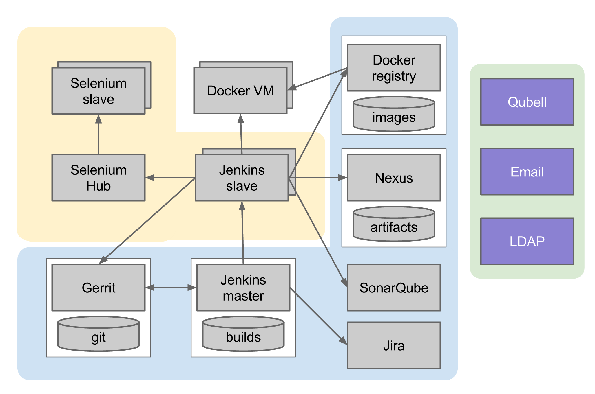

Agile Software Factory
======================

* [Getting Started](#getting-started)
	* [Overview](#overview)
	* [Architecture](#architecture)
	* [CI Workflow](#ci-workflow)
	* [Requirements](#requirements)
	* [Demo application](#demoapp)
* [Setup](#setup)
	* [Step-by-step Setup Guide](#step-by-step-setup)
* [Developer Guide](#develop)
* [Known Issues](#issues)

# Getting Started

## Overview

Agile Software Factory is the foundation for an efficient, scalable, and reliable development and release process. By modeling processes after a conveyor belt or pipeline, ASF gives structure to your software development process. This allows engineering teams to focus on implementing functionality instead of fighting with operational issues.

## Architecture

Agile Software Factory consists of 10 main components:

- **Jenkins** - CI-server, build, verify code, run code analysis and deploy artifacts into repository
- **Gerrit** - code review tool and source code repository manager
- **LDAP** - centralized store of user accounts information for authentication on other components
- **JIRA** - project management software, aggregates statuses for all other components
- **Nexus** - artifact repository, stores successfully built artifacts from Jenkins
- **Sonar** - collects and analyze code metrics
- **SeleniumGrid** - run integration tests on cluster
- **Docker Registry** - self-hosted docker images repository
- **Docker VM** - instance for deploying CI applications for integration testing

All components of ASF integrated with each other and provide fully working CI pipeline out of the box. List of integrations:

- **Authentication with LDAP** - using LDAP as main authentication provider for all services
- **Automated Jenkins code review** - Automated build and marking `verified -1/+1` each review
- **Gerrit review status in JIRA** - show reviews in following JIRA issues by key in the commit message
- **Jenkins job status in JIRA** -  show job status in following JIRA issues by key in the checkout commit message
- **Email notification** - notify about builds, reviews and JIRA issues status

## CI Workflow

## Requirements

Agile Software Factory requires minimum 9 m3.medium AWS instances for infrastructure and one m3.large for Jenkins slave. Estimated costs of infrastructure is $<cost>/month. Currently ASF can be launched **only in us-east** AWS region.

List of images required by ASF:

| Name | Image AMI |
|------|-----------|
| CentOS 6.3 x64 | us-east-1/ami-b028aad8 |
| CoreOS-beta-557.2.0 | us-east-1/ami-5e9bd836 |
| asf-jenkins-ubuntu-slave | us-east-1/ami-aacbe6c2 |

All instances required public ips, launching in **VPC currently not supported**.

## Demo application

## Setup

### Step-by-step Setup Guide
- **[Step 1. Set up and Configure an Amazon Web Services (AWS) Account](docs/install-guide/step-1.md)**
- **[Step 2. Set up a Qubell Account](docs/install-guide/step-2.md)**
- **[Step 3. Obtain the Agile Software Factory](docs/install-guide/step-3.md)**
- **[Step 4. Launch and post-deployment](docs/install-guide/step-4.md)**

License and Authors
-------------------
Authors:
- Alexey Kornev <akornev@griddynamics.com>
- Grigory Silantiev <gsilantyev@griddynamics.com>
- Nikolay Yurin <nyurin@griddynamics.com>
